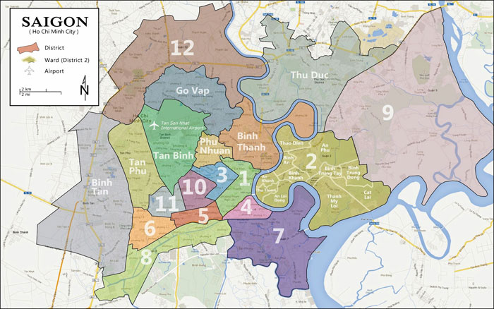

# Ho Chi Minh City Rental and Selling Real Estate Analysis 
Final project for Introduction to Data Science course - HCMUS 2023. 

*Note: Project was completed before the change in administrative geography in 2025 (which still contain district level)* 

| ID | Member | Section |
|----|---------|--------|
| 21120275 | Huynh Cao Khoi | Selling real estate (Part 1) |
| 21120308 | Pham Le Tu Nhi | Rental real estate (Part 2) | 

## 1. Introduction 
The project aim to collect, analyse and build ML models to predict real estate services cost in Ho Chi Minh city, by going step by step through phases of a Data Science project. The data is collected from [batdongsan.com](https://batdongsan.com.vn/)

## 2. Technologies 
The following technologies are used in the project:
- `cloudscraper`: Light-weight library for web scraping
- `pandas`: Dataframe manipulation for data cleaning and processing
- `numpy`: Array manipulation for basic statistics analysis
- `matplotlib`, `plotly`: Data visualization
- `scikit-learn`: Build and train ML models
- `streamlit`: Deployment for real estate cost prediction web service

## 3. Analysis results 
We found that there are a great variation of cost between the **type** and **location** of a property. (We also need to emphasise that the data is collect from 1 website at 1 period of time (the end months of 2023), which could introduce great bias). This is a summaries of our finding. 

  
*Source: khudothi.vn*

### Rental properties 
- Rental real estate divides into living and commercial types: `apartments` dominate Districts 2 and 7, `rented rooms` in Tân Bình and Bình Thạnh; `warehouses` appear in suburban areas (Bình Tân, District 2), while `offices` and `front-houses` cluster in central districts (1, 2, 3).
- Cost of a property fluctuate a lot depends on **location** (demand for that type of property) and **quality of the property** (area is important to comercial type, while living amenities is important to living type). To take an example, `apartment flats` are most popular and most expensive in District 2 and 1 (central area) and cheapest in District 9 and Hóc Môn District (~ country side area).
- Each district has distinct rental patterns. For example: District 1 linked to `street-front` and `rental rooms`, District 2 to `apartments`, `shophouses`, and `private houses`, and District 3 to `street-front houses`.

### Selling properties  
- Selling real estate has a varied distribution across types and locations. The most common types are `personal houses` and `street-front houses`, which appear in most of districts. `Apartments` are concentrated in the central districts such as `District 1`, `District 2`, `Disrict 4`, `Bình Thạnh`, `Bình Tân`. Another significant type of real estate for sale is `lands`, which are mainly found in larger and more distant district like `Cần Giờ`, `Củ Chi` and `Tân Phú`.
- The price of the real estate depends on its type. The most expensive types are `villas` and `street-front houses`, followed by `lands`, `personal houses` and `apartments`. In each type, the prices also vary by the location: In more expensive district like `District 1` or `District 2`, prices are higher compared to outer district like `District 12` or `Thủ Đức`.
## 4. ML Building Results
### Objective
We want to build a machine learning model to predict the selling and rental apartment price, using the collected features.

### Method 
- We use `GridSearchCV` to search for the best models and corresponding parameters. The following models are considered: `Linear Regression`, `Ridge Regression`, `Lasso Regression`, `ElasticNet Regression`, `DTree Regression` and `Random Forest`.
- **Rental Prediction**: Best model is `Lasso Regression` with alpha 0.1. 
  
- **Selling Prediction**: The best mode is the `Random Forsest` model, but considering the inference time, we use the `Desicion Tree` model for deployment.

## 5. Model deployment:
- We deployed the best model using a Streamlit app [here]:(https://i2ds-finalproject.streamlit.app/)
- After inputing all the neccessary features, the app will display the predicted price as shown below:
  

Work management resource: [Notion](https://hickory-adasaurus-926.notion.site/IDS-Team-8a6f7c93f2834c759af4f77fdad9f2ef?pvs=74).
